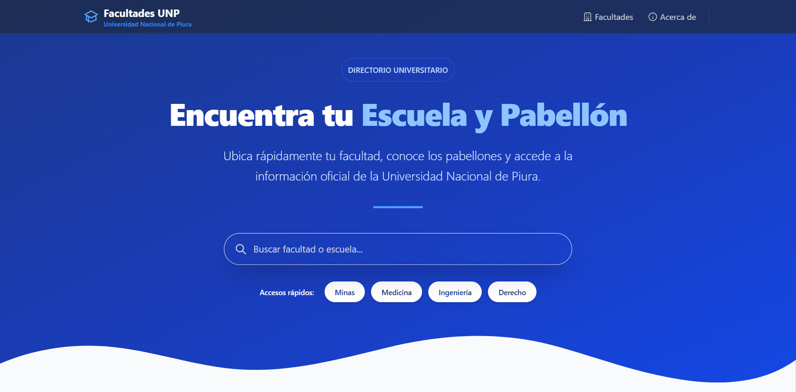

# 📚 Sistema de Gestión de Facultades UNP

[](https://nextjs.org/)
[](https://www.mysql.com/)
[](https://tailwindcss.com/)
[](https://vercel.com/)
[](https://www.docker.com/)
[](https://cloudinary.com/)

> 🎓 Plataforma integral para la administración académica. Gestiona tus facultades de manera sencilla, moderna y eficiente.


## 📱 Demo

<div align="center">
  <h3>Vista Desktop</h3>
  
  
  <h3>Vista Mobile</h3>
  <div style="display: flex; justify-content: center; gap: 20px;">
    
    
  </div>
</div>

## 🎯 Descripción General

Aplicación web para la gestión completa de facultades universitarias. Este proyecto proporciona una interfaz CRUD (Crear, Leer, Actualizar, Eliminar) con un diseño moderno, responsivo y optimizado para todos los dispositivos.

Desarrollado como parte del ecosistema académico de la Universidad Nacional de Piura (UNP), este sistema facilita la administración eficiente de la información de las diferentes facultades.

## ✨ Características

| Característica                | Descripción                                                                |
| ----------------------------- | -------------------------------------------------------------------------- |
| ✅ **Creación**               | Agrega nuevas facultades con imágenes y toda su información relevante      |
| 📖 **Visualización**          | Lista completa de facultades con tarjetas interactivas y página de detalle |
| 🔄 **Actualización**          | Edición completa de información e imágenes de facultades existentes        |
| 🗑️ **Eliminación**            | Eliminación segura con confirmación para prevenir errores                  |
| 📱 **Responsive**             | Diseño adaptable a cualquier dispositivo (móvil, tablet, escritorio)       |
| 🖼️ **Gestión de imágenes**    | Soporte para carga, actualización y optimización de imágenes               |
| 🌐 **API RESTful**            | Integración completa con endpoints para todas las operaciones              |
| 🚀 **Rendimiento optimizado** | Renderizado dinámico para máxima velocidad y estabilidad                   |

## 🛠️ Stack Tecnológico

<table>
  <tr>
    <th>Tecnología</th>
    <th>Propósito</th>
    <th>Versión</th>
  </tr>
  <tr>
    <td></td>
    <td>Framework Frontend & Backend</td>
    <td>14.2.5</td>
  </tr>
  <tr>
    <td></td>
    <td>Base de Datos</td>
    <td>8.0</td>
  </tr>
  <tr>
    <td></td>
    <td>Estilos y Diseño</td>
    <td>3.4.1</td>
  </tr>
  <tr>
    <td></td>
    <td>Contenedores</td>
    <td>Latest</td>
  </tr>
  <tr>
    <td></td>
    <td>Almacenamiento de Imágenes</td>
    <td>API v2</td>
  </tr>
  <tr>
    <td></td>
    <td>UI Interactiva</td>
    <td>18+</td>
  </tr>
</table>

## 📋 Prerrequisitos

- ✅ Node.js ≥ 18 o Bun runtime
- ✅ Docker & Docker Compose (recomendado)
- ✅ MySQL 8.0
- ✅ npm o bun package manager

## 🚀 Instalación

```bash
# Clonar el repositorio
git clone https://github.com/dev-sandoval/list-faculties-unp.git

# Navegar al directorio del proyecto
cd list-faculties-unp

# Instalar dependencias
npm install
# o con bun
bun install

# Iniciar contenedores Docker en modo desarrollo
docker-compose up web-dev -d

# Iniciar contenedores Docker en modo producción
docker-compose up web-prod -d

# Inicializar base de datos
docker exec -i db_facultades mysql -u user_facultades -ppassword < database/db.sql

# Ejecutar servidor de desarrollo
npm run dev
# o con bun
bun run dev
```

## 💾 Configuración de Base de Datos

El esquema de la base de datos incluye:

```sql
CREATE TABLE faculties (
    id          int primary key auto_increment,
    name        varchar(100) not null,
    description text,
    path_img    VARCHAR(255)
);
```

## 🔐 Variables de Entorno

Crea un archivo `.env` con:

```env
# Base de datos
DB_HOST=localhost
DB_USER=adm
DB_PASSWORD=adm
DB_DATABASE=facultades
DB_PORT=3306

# Cloudinary
CLOUDINARY_CLOUD_NAME=your_cloud_name
CLOUDINARY_API_KEY=your_api_key
CLOUDINARY_API_SECRET=your_api_secret

# URLs
NEXT_PUBLIC_BACKEND_URL=localhost:3000
NEXT_PUBLIC_VERCEL_URL=your-app.vercel.app
```

## 📁 Estructura del Proyecto

```
list-faculties-unp/
├── 📂 src/
│   ├── 📂 app/            # Páginas Next.js
│   ├── 📂 components/     # Componentes React
│   └── 📂 libs/           # Utilidades y configuraciones
├── 📂 database/           # Scripts de base de datos
├── 📂 docker/             # Configuración Docker
│   ├── 📂 deployment/     # Config para producción
│   └── 📂 development/    # Config para desarrollo
├── 📂 docs/               # Documentación
│   ├── 📄 release-v1.0.0.md
│   ├── 📄 release-v2.0.0.md
│   └── 📄 release-v3.0.0.md
└── 📂 public/             # Activos estáticos
```

## 🔄 Endpoints de la API

| Endpoint             | Método | Descripción                  | Auth |
| -------------------- | ------ | ---------------------------- | ---- |
| `/api/faculties`     | GET    | Obtener todas las facultades | No   |
| `/api/faculties`     | POST   | Crear nueva facultad         | No   |
| `/api/faculties/:id` | GET    | Obtener facultad por ID      | No   |
| `/api/faculties/:id` | PUT    | Actualizar facultad          | No   |
| `/api/faculties/:id` | DELETE | Eliminar facultad            | No   |

## 📝 Historial de Versiones

| Versión                            | Fecha      | Características                                                        |
| ---------------------------------- | ---------- | ---------------------------------------------------------------------- |
| [v3.0.0](./docs/release-v3.0.0.md) | Abril 2025 | Mejoras de rendimiento, optimización para Vercel, renderizado dinámico |
| [v2.0.0](./docs/release-v2.0.0.md) | Abril 2025 | Diseño responsivo mejorado, optimización de componentes                |
| [v1.0.0](./docs/release-v1.0.0.md) | Enero 2025 | Lanzamiento inicial con funcionalidades CRUD básicas                   |

## 🤝 Contribuciones

Las contribuciones son bienvenidas. Por favor, sigue estos pasos:

1. 🍴 Haz un fork del repositorio
2. 🌿 Crea tu rama de características (`git checkout -b feature/CaracteristicaIncreible`)
3. 💾 Haz commit de tus cambios (`git commit -m 'Añadir alguna CaracteristicaIncreible'`)
4. 📤 Sube la rama (`git push origin feature/CaracteristicaIncreible`)
5. 📩 Abre un Pull Request

## 📄 Licencia

Este proyecto está licenciado bajo la Licencia MIT - ver el archivo LICENSE para más detalles.

---

## 👨‍💻 Autor

### [David Sandoval](https://github.com/dev-sandoval)

- 🌐 Portafolio: [devsandoval.me](https://devsandoval.me)
- 💼 LinkedIn: [@devsandoval](https://linkedin.com/in/devsandoval)
- 💻 GitHub: [@dev-sandoval](https://github.com/dev-sandoval)
- 📧 Email: [contact@devsandoval.me](mailto:contact@devsandoval.me)

---

Desarrollado por [@dev-sandoval](https://github.com/dev-sandoval)

> **Nota**: Este proyecto fue creado con fines educativos y de entretenimiento. Siéntete libre de
> utilizarlo y modificarlo según tus necesidades.
